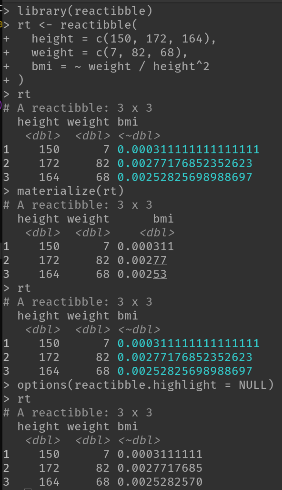

<!-- badges: start -->
[](https://codecov.io/gh/moodymudskipper/reactibble?branch=master)
<!-- badges: end -->


```{r, include = FALSE}
knitr::opts_chunk$set(
  collapse = TRUE,
  comment = "#>",
  fig.path = "man/figures/README-",
  out.width = "100%"
)
```

# reactibble

IN PROGRESS

Reactive columns for data frames! 

Original twitter thread here : https://twitter.com/antoine_fabri/status/1346421382981283840

New thread: https://twitter.com/antoine_fabri/status/1346839934783643652

## Installation

Install with:

``` r
remotes::install_github("moodymudskipper/reactibble")
```

## Example

```{r, include= FALSE}
set.seed(1)
```


`reactibble()` works like `tibble()` except we can define reactive columns by
using `~`:

```{r}
library(reactibble)
rt <- reactibble(
  height = c(150, 172, 164),
  weight = c(7, 82, 68),
  bmi = ~ weight / height^2
)
rt
```

Oops, height was in the wrong unit, we correct it, bmi is corrected as well:

```{r}
rt <- transform(rt, height = height/100)
rt
```

It is robust to other ways to change values

```{r}
rt[[1]] <- runif(3, 1.5, 2)
rt

rt[1] <- runif(3, 1.5, 2)
rt

rt$height <- runif(3, 1.5, 2)
rt

rt <- within(rt, height <- runif(3, 1.5, 2))
rt
```

Note that reactive columns are shown in cyan (not in rendered output, such as this document). 




This is configurable via the option "reactibble.highlight". 
Set to another `{crayon}` function to change the style.

```{r}
options(reactibble.highlight = crayon::yellow)
rt
```

Set this option to `NULL` to disable highlighting of reactive columns.

We can add other reactive columns by using `mutate` with `~`, we'll need to
attach *{dplyr}* :

```{r}
library(dplyr, warn.conflicts = FALSE)
mutate(
  rt, 
  height_cm = ~ 100 * height, 
  height = runif(3, 1.5, 2)
  )
```


## Notes

* If for some reason a reactibble is out of sync, call `rt <- refresh(rt)` (and post an issue :)).
* If you want to disable autorefresh, maybe because your columns are expensive to recompute, set `options(reactibble.autorefresh = FALSE)`.
* At the moment (and maybe forever), only `mutate` can create new reactive columns, so you can't do things like `rt$var <- ~ expr`.
* Dropping a column used by a formula triggers an explicit error
* Renaming a column updates the formulas so they use the new name
