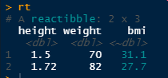
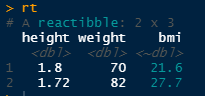

```{r, include = FALSE}
knitr::opts_chunk$set(
  collapse = TRUE,
  comment = "#>",
  fig.path = "man/figures/README-",
  out.width = "100%"
)
```

# reactibble

IN PROGRESS!

*{reactibble}* implements reactive columns in data frames.

We build them using the `reactibble()` function, and define reactive columns
using formulas.

```{r}
library(reactibble)
rt <- reactibble(
  height = c(1.50, 1.72),
  weight = c(70, 82),
  bmi = ~ weight / height^2
)
```



As you can see, the reactive columns are displayed in a different color, and
the type of the column is prefixed with `"~"`.

Then whenever we change a value, the reactive column is updated.

```{r}
rt$height[1] <- 1.80
```



It is reminescent database views, excel calculated columns or reactive 
DataTables in `{shiny}`.

The package provides functions and methods to modify the data and ease memoisation
of operations.


## Installation

Install with:

``` r
remotes::install_github("moodymudskipper/reactibble")
```

## Modify the data

You can add or modify columns using *{dplyr}* functions `mutate()` and `transmute()`,
use a formula if you wish to add a new reactive column. Building on our example above :

```{r}
library(dplyr, warn.conflicts = FALSE)
rt <- mutate(rt, height_cm = ~ height * 100)
rt
```

To add rows we can use the functions `rt_bind_rows()` or `rt_add_row()`,
counterpart to `dplyr::bind_rows()` and `tibble::add_row()` which unfortunately
don't work reliably on `"reactibble"` objects.

```{r}
rt <- rt_add_row(rt, height = 1.64, weight = 68)
rt
```

To get a static object (still of class reactibble), call `materialize()`

```{r}
materialize(rt)
```

We implemented methods for *{dplyr}*'s join functions so that they should work
seamlessly on `"reactibble"` reactibble objects, provided the first argument is
a `"reactibble"`.

Renaming, selecting, dropping columns, slicing, will work seamlessly with the method
of your choice. 
In case of renaming the formula of the reactive columns will adapt to the new names,
and if a necessary column is dropped an explicit error will be triggered.

Some functions outside of this package will work well natively on
*{reactibble}*, such as `base::split()`, others will warn, such as `base::transform()`,
while others might unfortunately strip off the class or attributes silently, or
put the reactibble out of sync.

We hope through time to provide methods for most generics posing problems, and
`rt_*` alternatives for other problematic functions, if you want to help, 


## Refreshing

The columns of a `"reactibble"` object are recomputed anytime the object is modified.
In some cases this can be costly in terms of resources, we can deal with this
either by memoising the columns (next section) or enabling manual refresh (present section).

We can disable the autorefresh, do the transformation we need with the latest
computed values, and refresh once we're done.

```{r}
options(reactibble.autorefresh = FALSE)
rt <- mutate(rt, weight_g = ~weight * 1000)
# not yet refreshed 
rt
# now refreshed
rt <- refresh(rt)
rt
# go back to default
options(reactibble.autorefresh = TRUE)
```

## Memoise

The other, arguably more convenient way to deal with redundant computations is 
to memoise them. For this we implemented a handy feature that wraps
the *{memoise}* package which 
.

Wrap the function that you want to memoise in `M()` and whenever its fed the same
input when refreshing the column, it will retrieve the result in memory.

See example below where we memoise respectively the full column and rowwise results.

### Full column memoisation 

```{r}
slow_mean <- function(...) {
  Sys.sleep(1)
  mean(c(...))
}

# the function is run the first time, taking one second
system.time(
  rt <- reactibble(a=1:3, b = ~ M(slow_mean)(a))
)
rt

# If we transform the data without affecting b, we use results stored in
# memory, saving resources
system.time(
  rt <- mutate(rt, c = ~ b * 2)
)
```

### Rowwise memoisation

We can memoise rowwise computations that wrapping the call in an apply function
(`lapply()`, `sapply()`, `mapply()`, `Map()`, or functions from the `purrr::map*()` family)

```{r}
# the function is executed 3 times, takes 3 seconds
system.time(
  rt <- reactibble(a=1:3, b = 2:4, c = ~ mapply(M(slow_mean),a, b))
)
rt

# if we add a single row, it will take only one more second to update
system.time(
  # careful not to change the type from integer to double!
  rt <- rt_add_row(rt, a=4L, b = 5L) 
)
rt
```
