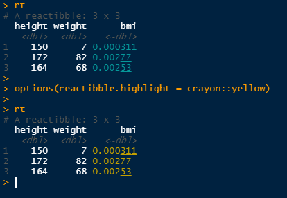

# reactibble

IN PROGRESS

Reactive columns for data frames\!

Original twitter thread here :
<https://twitter.com/antoine_fabri/status/1346421382981283840>

New thread:
<https://twitter.com/antoine_fabri/status/1346839934783643652>

## Installation

Install with:

``` r
remotes::install_github("moodymudskipper/reactibble")
```

## Example

`reactibble()` works like `tibble()` except we can define reactive
columns by using `~`:

``` r
library(reactibble)
rt <- reactibble(
  height = c(150, 172, 164),
  weight = c(7, 82, 68),
  bmi = ~ weight / height^2
)
rt
#> # A reactibble: 3 x 3
#>   height weight      bmi
#>    <dbl>  <dbl>   <~dbl>
#> 1    150      7 0.000311
#> 2    172     82 0.00277 
#> 3    164     68 0.00253
```

Oops, height was in the wrong unit, we correct it, bmi is corrected as
well:

``` r
rt <- transform(rt, height = height/100)
rt
#> # A reactibble: 3 x 3
#>   height weight    bmi
#>    <dbl>  <dbl> <~dbl>
#> 1   1.5       7   3.11
#> 2   1.72     82  27.7 
#> 3   1.64     68  25.3
```

It is robust to other ways to change values

``` r
rt[[1]] <- runif(3, 1.5, 2)
rt
#> # A reactibble: 3 x 3
#>   height weight    bmi
#>    <dbl>  <dbl> <~dbl>
#> 1   1.63      7   2.63
#> 2   1.69     82  28.8 
#> 3   1.79     68  21.3

rt[1] <- runif(3, 1.5, 2)
rt
#> # A reactibble: 3 x 3
#>   height weight    bmi
#>    <dbl>  <dbl> <~dbl>
#> 1   1.95      7   1.83
#> 2   1.60     82  32.0 
#> 3   1.95     68  17.9

rt$height <- runif(3, 1.5, 2)
rt
#> # A reactibble: 3 x 3
#>   height weight    bmi
#>    <dbl>  <dbl> <~dbl>
#> 1   1.97      7   1.80
#> 2   1.83     82  24.5 
#> 3   1.81     68  20.7

rt <- within(rt, height <- runif(3, 1.5, 2))
rt
#> # A reactibble: 3 x 3
#>   height weight    bmi
#>    <dbl>  <dbl> <~dbl>
#> 1   1.53      7   2.99
#> 2   1.60     82  31.9 
#> 3   1.59     68  27.0
```

Note that reactive columns are shown in cyan (not in rendered output,
such as this document).

This is configurable via the option “reactibble.highlight”. Set to
another *{crayon}* function to change the style.



``` r
options(reactibble.highlight = crayon::yellow)
rt
#> # A reactibble: 3 x 3
#>   height weight    bmi
#>    <dbl>  <dbl> <~dbl>
#> 1   1.53      7   2.99
#> 2   1.60     82  31.9 
#> 3   1.59     68  27.0
```

Set this option to `NULL` to disable highlighting of reactive columns.

We can add other reactive columns by using `mutate.reactibble` (or just
`mutate` if *{dplyr}* is attached) with `~` : attach :

``` r
library(dplyr, warn.conflicts = FALSE)
mutate(
  rt, 
  height_cm = ~ 100 * height, 
  height = runif(3, 1.5, 2)
  )
#> # A reactibble: 3 x 4
#>   height weight    bmi height_cm
#>    <dbl>  <dbl> <~dbl>    <~dbl>
#> 1   1.84      7   2.06      184.
#> 2   1.69     82  28.6       169.
#> 3   1.88     68  19.1       188.
```

## Notes

  - If for some reason a reactibble is out of sync, call `rt <-
    refresh(rt)` (and post an issue :)).
  - If you want to disable autorefresh, maybe because your columns are
    expensive to recompute, set `options(reactibble.autorefresh =
    FALSE)`.
  - At the moment (and maybe forever), only `mutate` can create new
    reactive columns, so you can’t do things like `rt$var <- ~ expr`.
  - Dropping a column used by a formula triggers an explicit error
  - Renaming a column updates the formulas so they use the new name
